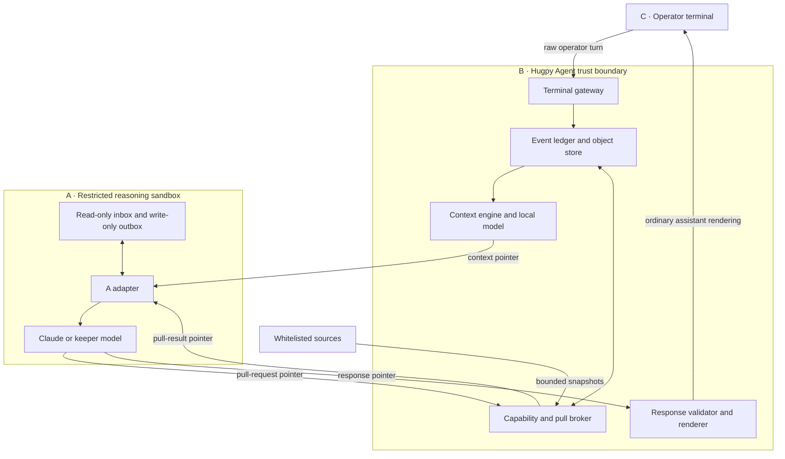
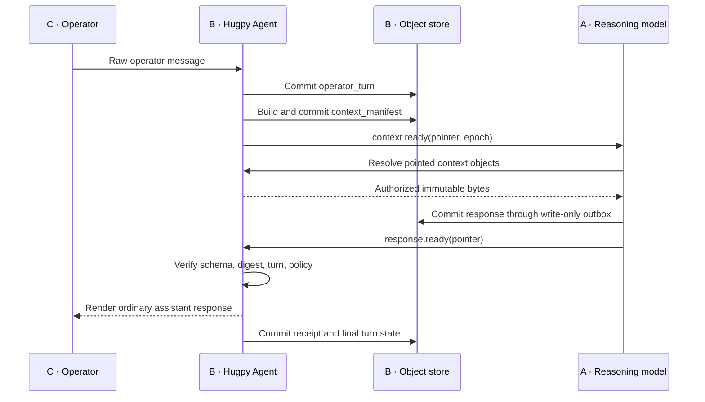
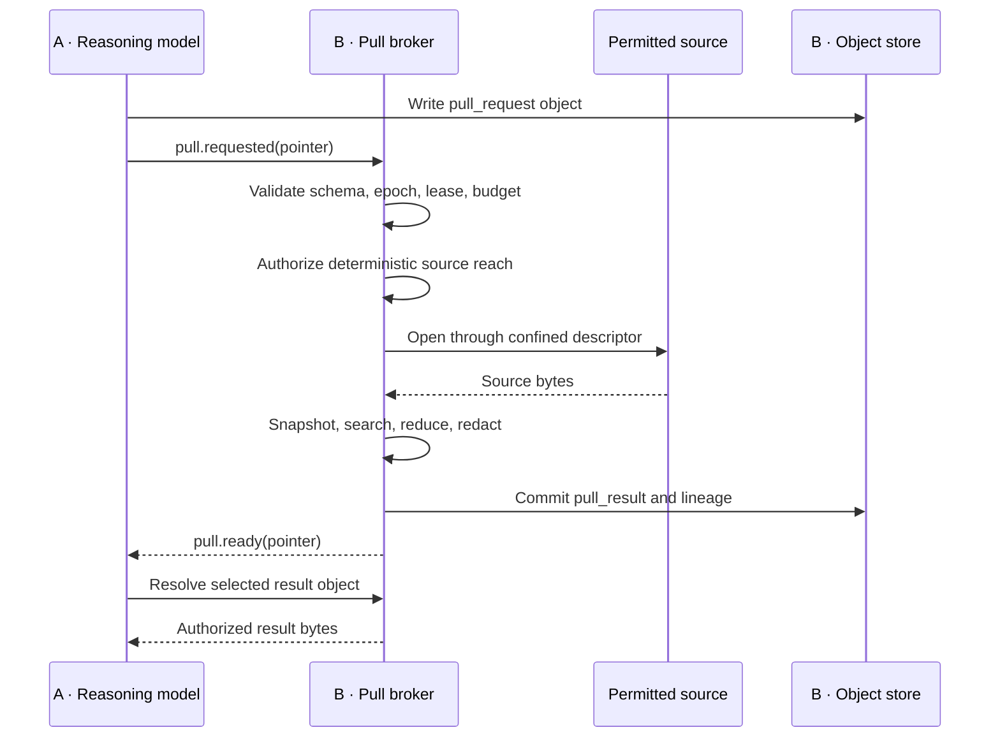
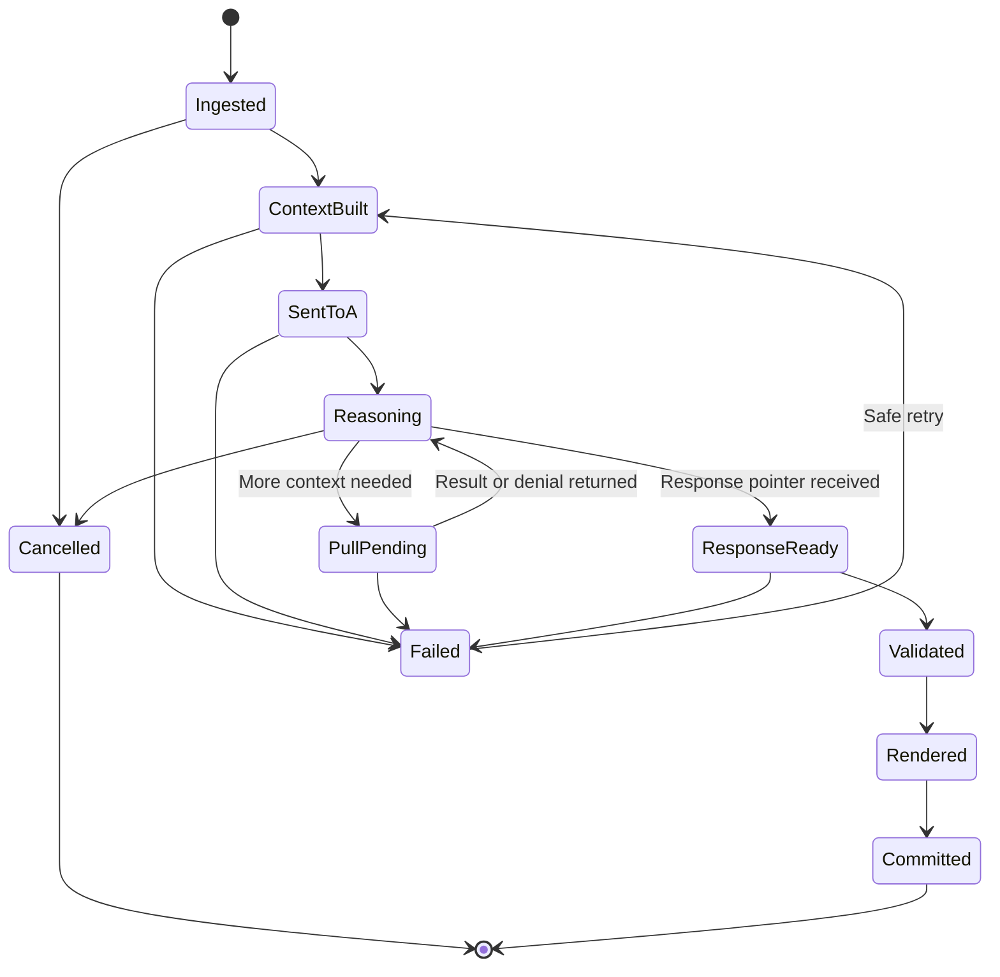
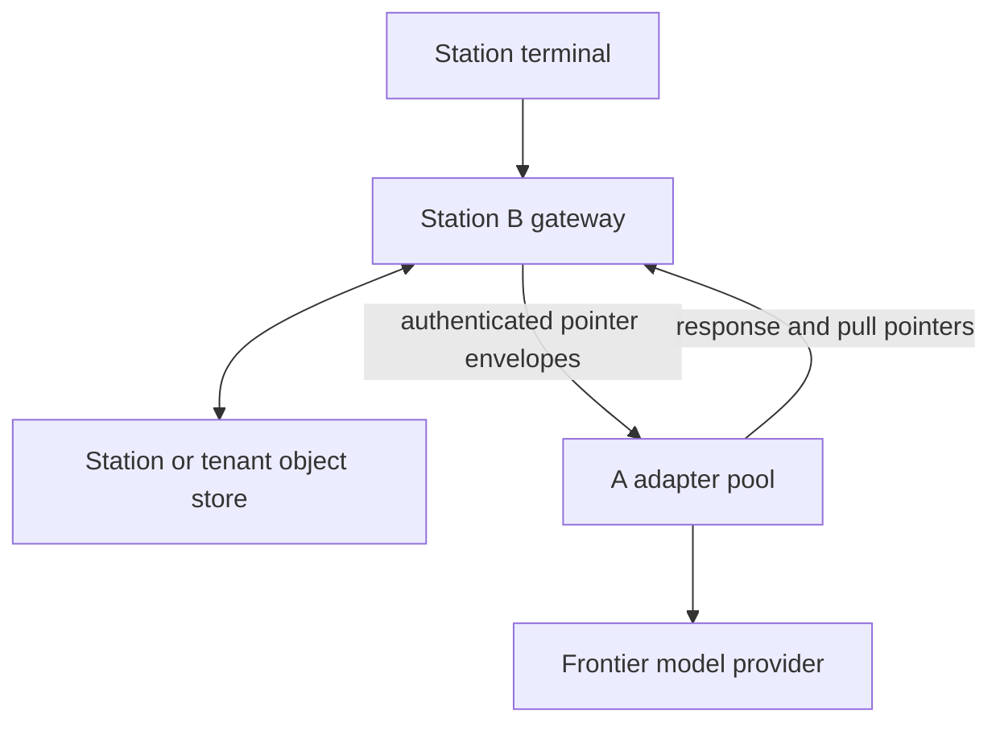
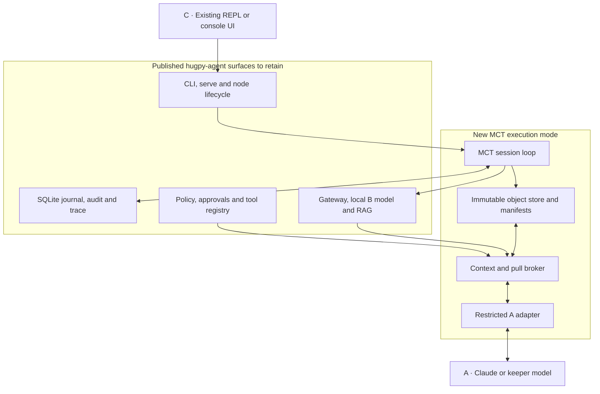

# Mediated Context Terminal (MCT)

**A three-position, pointer-mediated terminal harness**  
Design baseline: v1.0 · 2026-08-01 · Status: proposed architecture

## 0. Executive summary

The Mediated Context Terminal preserves the operator experience of a normal assistant terminal while changing the internal execution path:

- **C — Operator:** types and reads messages in one ordinary terminal.
- **B — [hugpy-agent](https://pypi.org/project/hugpy-agent/) / local model:** is the only component that receives the operator's raw input directly. The published package is the concrete B baseline; it stores the durable conversation, selects the minimum context A needs, enforces access, resolves all pulls, and renders the final answer.
- **A — Claude / keeper-class model:** performs the high-value reasoning. It receives a pointer to a context object, not an inline transcript. If it needs more information, it asks B. It returns a pointer to its response object.

Normal operation looks unchanged to C. Internally, B becomes a context broker, durable memory manager, capability broker, and response relay.

The design deliberately separates two ideas that are easy to conflate:

1. **The control plane is pointer-only.** B and A exchange short, authenticated object references plus routing metadata.
2. **The data still has to enter A's context when A reads it.** Pointers do not eliminate token use. They prevent repeated inline transport, allow selective pulls, and keep the complete history outside A's active context window.

The durable conversation can grow without practical transcript limits; A's per-turn working set remains bounded.

---

## 1. Goals

### 1.1 Primary goals

1. Preserve the visual and behavioral feel of a direct operator-to-A terminal.
2. Ensure only B receives raw operator input directly.
3. Keep full-fidelity history and source material outside A's active context.
4. Let B build a compact, task-specific working set for every A turn.
5. Let A pull missing information, with B as the sole intermediary and arbiter.
6. Make A's effective reach no broader than B permits.
7. Make every context decision, pull, denial, response, and cache transition auditable.
8. Survive B, A, terminal, and host restarts without silently losing state.
9. Avoid repeated lossy summarization by retaining immutable originals and provenance.
10. Support a local prototype first and a fleet deployment without changing the protocol.

### 1.2 Secondary goals

- Reduce frontier-model input tokens on long-running sessions.
- Reduce context churn and improve prompt-cache stability when A's provider supports it.
- Let a local model perform retrieval, excerpting, classification, and compaction.
- Make large files and logs available through bounded excerpts instead of bulk ingestion.
- Permit streaming output without placing full response bodies on the control channel.
- Support multiple A implementations behind the same adapter contract.

### 1.3 Non-goals

- Giving A unrestricted access to B's filesystem.
- Treating a pointer as if its target were already known to A.
- Allowing B's local model to make security decisions by itself.
- Silently substituting B for A as the answering model.
- Destroying or replacing original history after summarization.
- Allowing summaries to become untraceable sources of truth.
- Guaranteeing that an external provider's hidden KV cache contains anything unless its API explicitly confirms it.

---

## 2. Roles and authority

| Position | Component | Responsibilities | Must not do |
| --- | --- | --- | --- |
| **C** | Operator and terminal UI | State intent, approve sensitive actions, receive output, cancel or redirect work | Reach A directly or depend on internal routing knowledge |
| **B** | Hugpy Agent, local model, deterministic broker | Ingest, persist, retrieve, compact, authorize, materialize, arbitrate pulls, track epochs, validate output pointers, render | Widen its own host authority, silently rewrite A's voice, use model judgment as the security boundary |
| **A** | Claude or another keeper-class model | Reason, plan, request missing context, produce response and optional action proposals | Read arbitrary paths, bypass B, assume omitted context, silently expand scope |

The authority relationship is:

```text
operator grant
    intersected with B's operating-system reach
    intersected with session policy
    intersected with tool policy
    intersected with the specific request scope
    equals A's effective capability for that operation
```

B's host permissions are the hard ceiling. B should narrow that ceiling per session and per request.

---

## 3. Core invariants

These are correctness requirements, not implementation preferences.

1. **A has no ambient file or network authority.** A can only use capabilities exposed through its B adapter.
2. **The current operator message is immutable.** B may annotate or interpret it, but must not silently replace it with a summary.
3. **Control-plane messages contain references, not conversational bodies.** Routing metadata is allowed; payload content lives in immutable objects.
4. **Every object is integrity-addressed.** A resolver verifies the recorded digest before exposing bytes.
5. **A never receives a raw host path.** It receives an opaque, session-scoped object handle.
6. **All A reads are observed by B's transport.** B records what was actually opened, not merely what it offered.
7. **Delivery is not residency.** B may know A opened an object, but must not assume it remains in A's active context after an epoch change.
8. **Compaction is reversible.** Every summary or excerpt retains pointers to its source objects.
9. **Security is deterministic.** The local model may rank and summarize; code and OS controls authorize.
10. **B never silently impersonates A.** If a deployment later permits B-only answers, provenance must be visible.
11. **Normal rendering is exact.** B renders A's response body as written unless a declared policy transform blocks or redacts it.
12. **A pull cannot widen authority.** Pulls can only narrow or materialize already permitted reach.
13. **Restarts change the epoch.** Any cache-residency assumption is invalidated unless explicitly re-established.
14. **Display is idempotent.** A response object is rendered at most once for a given terminal turn.
15. **Original source bytes are never edited in place.** Changes create new immutable objects and revision links.

---

## 4. System architecture



### 4.1 Trust boundaries

- C trusts B to preserve the operator's exact message and faithfully render A's answer.
- B treats A, source files, tool output, and retrieved text as potentially adversarial inputs.
- A trusts only context objects whose manifests identify origin and authority.
- Whitelisted sources are not automatically trusted instructions; they are trusted only as data from a named origin.
- The object store is durable state. The runtime inbox/outbox is disposable transport state.

### 4.2 Why B is more than a proxy

B performs four distinct jobs:

| Plane | B's job |
| --- | --- |
| Conversation | Durable transcript, decisions, open questions, artifacts, and turn ordering |
| Context | Retrieval, ranking, deduplication, excerpting, summaries, token budgeting, provenance |
| Capability | Path confinement, policy checks, snapshotting, pull arbitration, write approval |
| Presentation | Exact response validation, stream relay, idempotent display, explicit errors |

These jobs should be separate modules even if they initially run in one process.

---

## 5. Operator experience

### 5.1 Normal turn

The terminal behaves as if C were speaking directly to A:

1. C types a message.
2. The terminal echoes C's message immediately.
3. B works invisibly unless the existing terminal normally displays tool activity.
4. A's response streams or appears in the assistant position.
5. No extra B label, routing header, or context report is shown.

### 5.2 When the illusion must break

The UI must become explicit when provenance or safety would otherwise be misleading:

- A is unavailable and B cannot complete the requested route.
- B is permitted to answer locally instead of A.
- B redacts, blocks, truncates, or materially rewrites A's response.
- An approval is required.
- Context retrieval fails in a way that may affect correctness.
- A's session resets and a retry or rehydration occurs.

The default design does **not** allow B-only answers. B is a broker and intermediary; A remains the answering model.

### 5.3 Cancellation and new input

- A user cancel marks the active turn cancelled, closes its pull leases, and prevents later response display.
- New ordinary input is queued behind the active turn by default.
- An explicit interrupt command may cancel the current turn and begin the new one.
- Late pointers from a cancelled or superseded turn are recorded but never rendered.

---

## 6. Control plane and data plane

### 6.1 Control plane

The control plane carries compact envelopes over a Unix socket, stdio framing, or mutually authenticated network transport.

Allowed contents:

- protocol version;
- message type;
- session, turn, sequence, and epoch identifiers;
- opaque object pointer;
- digest, byte count, media type, expiry, and idempotency metadata;
- error code whose detailed body is itself pointed to.

It does not carry prompts, source excerpts, responses, or summaries inline.

### 6.2 Data plane

The data plane carries immutable object bytes through B-controlled storage or a brokered virtual filesystem.

- B materializes A-readable objects into a read-only inbox or serves them through a resolver API.
- A writes only to a write-only outbox or a brokered object-creation API.
- A cannot enumerate B's store.
- A cannot exchange an object ID from another session.
- A cannot use the pointer as a host path.

### 6.3 Important qualification

"Only pointers cross the wire" applies to protocol messages. The content behind a pointer still crosses the data boundary when A opens it and still consumes A tokens when placed in the model prompt. The gain comes from selecting, reusing, and pulling content rather than repeatedly pasting the entire transcript.

---

## 7. Durable object model

### 7.1 Object properties

Every stored payload is:

- immutable;
- assigned an opaque object ID;
- hashed with SHA-256 or a comparable cryptographic digest;
- labeled with media type and schema version;
- scoped to a tenant, session, and visibility class;
- linked to provenance and parent objects;
- optionally encrypted at rest;
- subject to retention and legal-hold policy.

### 7.2 Pointer form

Illustrative pointer:

```text
mct://broker/session/s_01J.../object/o_01J...
```

The URI is an opaque handle, not a filesystem location. Authorization comes from the authenticated A channel plus B's capability ledger. Bearer secrets should not be embedded in the printable URI or logs.

### 7.3 Object classes

| Object kind | Purpose |
| --- | --- |
| `operator_turn` | Exact raw message from C plus terminal metadata |
| `context_manifest` | Ordered set of context fragments selected for A |
| `source_snapshot` | Immutable snapshot of a permitted workspace source |
| `excerpt` | Bounded lines, bytes, JSON fields, AST symbols, or search matches |
| `summary` | Derived compact representation with full source lineage |
| `pull_request` | A's request for missing information |
| `pull_result` | Fulfilled, reduced, redacted, or denied result |
| `response_body` | A's final assistant-facing content |
| `response_stream` | Sealed index of append-only response chunks |
| `context_receipt` | Adapter-recorded list of objects A opened |
| `error_detail` | Structured failure body referenced by a control envelope |
| `action_proposal` | Proposed filesystem, command, network, or external-side-effect action |
| `policy_snapshot` | Versioned record of policy used for a decision |

### 7.4 Physical storage

Prototype layout:

```text
/var/lib/hugpy-agent/mct/
├── objects/
│   └── sha256/ab/cd/<digest>
├── sessions/
│   └── <session-id>/
│       ├── ledger.sqlite3
│       ├── active-epoch.json
│       └── runtime/
│           ├── inbox/
│           └── outbox/
└── quarantine/
```

The object store may physically deduplicate bytes, but object IDs and authorization remain session-scoped. Cross-tenant presence must never be observable through timing, IDs, or errors.

### 7.5 Atomic commit

An object becomes visible only after:

1. bytes are written to a temporary file on the same filesystem;
2. the digest and size are verified;
3. the file is flushed and permissioned;
4. it is atomically renamed into the object store;
5. the containing directory is flushed;
6. its ledger record is committed.

An interrupted write is quarantined or garbage-collected; it never receives a valid pointer.

---

## 8. Protocol envelopes

### 8.1 Common control envelope

```json
{
  "v": "mct/1",
  "type": "context.ready",
  "session_id": "s_01J...",
  "turn_id": "t_000042",
  "sequence": 109,
  "epoch": "e_01J...",
  "object": "mct://broker/session/s_01J.../object/o_01J...",
  "sha256": "4d7f...",
  "media_type": "application/vnd.hugpy.mct-context+json",
  "bytes": 14288,
  "idempotency_key": "s_01J...:t_000042:context:1",
  "expires_at": "2026-08-01T20:15:00Z"
}
```

### 8.2 Message types

| Type | Direction | Meaning |
| --- | --- | --- |
| `context.ready` | B → A | Initial context manifest is available |
| `pull.requested` | A → B | A created a pull-request object |
| `pull.ready` | B → A | Result object is available |
| `pull.denied` | B → A | Structured denial object is available |
| `response.started` | A → B | Optional stream object has been established |
| `response.ready` | A → B | Sealed response manifest is ready |
| `receipt.ready` | adapter → B | Transport read receipt is ready |
| `turn.cancelled` | B → A | No later result may be rendered |
| `epoch.changed` | either | Assumptions about active context are invalid |
| `error` | either | Pointed error detail is available |

### 8.3 Context manifest

```json
{
  "schema": "mct.context/1",
  "session_id": "s_01J...",
  "turn_id": "t_000042",
  "epoch": "e_01J...",
  "operator_turn": {
    "object": "mct://broker/session/s_01J.../object/o_prompt",
    "required": true,
    "verbatim": true
  },
  "fragments": [
    {
      "object": "mct://broker/session/s_01J.../object/o_policy",
      "role": "governing_instruction",
      "priority": 100,
      "source": "session-policy",
      "revision": 7,
      "token_estimate": 620,
      "required": true
    },
    {
      "object": "mct://broker/session/s_01J.../object/o_decisions",
      "role": "decision_memory",
      "priority": 85,
      "source_objects": ["o_turn_31", "o_turn_36"],
      "token_estimate": 410,
      "required": false
    }
  ],
  "budget": {
    "maximum_input_tokens": 24000,
    "reserved_output_tokens": 8000,
    "pull_tokens_remaining": 12000
  },
  "catalog": "mct://broker/session/s_01J.../object/o_catalog",
  "previous_manifest_sha256": "6f24..."
}
```

### 8.4 Pull request

```json
{
  "schema": "mct.pull-request/1",
  "session_id": "s_01J...",
  "turn_id": "t_000042",
  "epoch": "e_01J...",
  "request_id": "pr_0003",
  "need": "Locate the first eviction decision for worker gpu-02",
  "target": {
    "kind": "catalog-query",
    "query": "gpu-02 eviction first decision"
  },
  "preferred_form": "matching lines with 20 lines of surrounding context",
  "maximum_tokens": 2400,
  "reason": "The supplied summary identifies the worker but not the first causal event",
  "required_fidelity": "verbatim-source",
  "allow_summary_fallback": true
}
```

### 8.5 Pull result

```json
{
  "schema": "mct.pull-result/1",
  "request_id": "pr_0003",
  "decision": "reduced",
  "objects": [
    {
      "object": "mct://broker/session/s_01J.../object/o_excerpt",
      "selector": "lines 819-873",
      "source": "mct://broker/session/s_01J.../object/o_log_snapshot",
      "sha256": "a907...",
      "token_estimate": 1210
    }
  ],
  "omitted": {
    "source_bytes": 41943040,
    "reason": "Request was satisfiable from a bounded excerpt"
  },
  "policy_revision": 12
}
```

### 8.6 Response manifest

```json
{
  "schema": "mct.response/1",
  "session_id": "s_01J...",
  "turn_id": "t_000042",
  "epoch": "e_01J...",
  "body": "mct://broker/session/s_01J.../object/o_response",
  "format": "text/markdown",
  "final": true,
  "opened_context": "mct://broker/session/s_01J.../object/o_receipt",
  "proposed_actions": [],
  "body_sha256": "138c..."
}
```

---

## 9. Normal turn flow



### 9.1 Detailed steps

1. The gateway assigns a session ID, monotonic turn ID, sequence number, and idempotency key.
2. B stores the raw message before performing model work.
3. Deterministic code extracts explicit paths, named artifacts, task constraints, and command intent.
4. The local model classifies intent and ranks candidate context; it cannot authorize access.
5. The context engine selects required policy, the exact current prompt, active task state, relevant decisions, source excerpts, and unresolved questions.
6. B commits the context manifest and sends only its pointer to A.
7. The A adapter resolves referenced objects through B and records actual reads.
8. A either answers or issues one or more pull requests.
9. A commits its response body into the outbox and returns a response-manifest pointer.
10. B verifies the response, seals any stream, and renders it exactly once.
11. B updates durable memory, indexes the new turn, and records any derived facts with provenance.

---

## 10. A-mediated pull flow



### 10.1 Arbitration order

B evaluates every pull in this order:

1. Validate protocol schema and message size.
2. Confirm session, turn, epoch, and unexpired pull lease.
3. Confirm the request stays within the operator's task scope.
4. Resolve the target against B's allowed roots using descriptor-based confinement.
5. Apply read/write/tool and sensitivity policy.
6. Estimate bytes and tokens before materialization.
7. Choose the least expansive satisfactory form.
8. Snapshot the selected source into an immutable object.
9. Return a result or a pointed, structured denial.
10. Charge the pull against turn quotas and record the decision.

### 10.2 Possible decisions

| Decision | Meaning |
| --- | --- |
| `exact` | Requested object or bounded selector is returned verbatim |
| `reduced` | A smaller excerpt, search result, symbol, or projection satisfies the need |
| `summarized` | Summary is returned with source pointers and an option to request exact evidence |
| `redacted` | Permitted content is returned after declared secret or privacy removal |
| `approval_required` | Operator confirmation is needed before access or action |
| `denied` | Request is outside scope or policy |
| `not_found` | Authorized search completed without a match |
| `budget_exhausted` | Pull count, token, byte, or time budget is exhausted |

### 10.3 Pull-loop controls

- maximum pulls per turn;
- cumulative source-byte limit;
- cumulative A-token limit;
- per-pull timeout and total turn deadline;
- repeated-query similarity detection;
- no-progress detection;
- operator approval for a justified budget increase;
- explicit denial reasons so A can reformulate rather than repeat.

---

## 11. Context engine

### 11.1 Context layers

| Layer | Contents | Inclusion rule |
| --- | --- | --- |
| L0 — invariant | System contract, active security policy, current exact operator turn | Always included |
| L1 — active task | Current goal, accepted plan, recent tool results, unresolved blockers | Included while task is active |
| L2 — durable memory | Decisions, preferences, entities, artifact versions, open questions | Retrieved by relevance and dependency |
| L3 — event history | Full prior messages, responses, pulls, approvals, source snapshots | Pulled or excerpted as needed |
| L4 — external sources | Workspace files, logs, databases, APIs permitted to B | Snapshotted only through the broker |

### 11.2 Candidate scoring

The local model can help estimate relevance, but final packing is deterministic and budget-aware. An illustrative score is:

\[
S_i = w_a A_i + w_r R_i + w_d D_i + w_f F_i + w_c C_i - w_z Z_i - w_u U_i
\]

Where:

- \(A_i\): authority or instruction priority;
- \(R_i\): semantic relevance to the current turn;
- \(D_i\): dependency importance for already selected items;
- \(F_i\): freshness;
- \(C_i\): continuity value for the active task;
- \(Z_i\): token-size cost;
- \(U_i\): redundancy with selected context.

Required items bypass scoring. Optional items are packed under the input budget, with reserved space for pulls and output.

### 11.3 Current prompt handling

B always stores the operator's raw turn verbatim. The initial A context includes either:

- the exact current prompt; or
- a pointer that A's adapter automatically opens as a required object before inference.

B may add a structured intent interpretation, but A can compare it to the original. Historical messages may be summarized; the current operator instruction is not silently summarized away.

### 11.4 Compaction products

B maintains distinct derived products rather than one ever-growing summary:

- active-task brief;
- canonical decisions with revision history;
- stable operator preferences;
- entity and artifact index;
- unresolved questions and blockers;
- tool-result abstracts;
- source catalogs;
- episodic summaries for older turn ranges.

Each derived fact includes:

- source object IDs;
- extraction method and model version;
- created and last-validated timestamps;
- confidence;
- superseded-by links;
- sensitivity label;
- scope: session, project, station, or global.

### 11.5 Deduplication

1. Exact byte duplicates share a content digest.
2. Near-duplicate summaries may be clustered for ranking.
3. Semantic similarity never deletes originals.
4. Conflicting facts are retained together and marked as a conflict.
5. A new source invalidates a derived summary only if its dependency graph intersects.
6. Stable context is ordered consistently to improve provider prompt caching.

### 11.6 Context catalog

A receives a compact catalog pointer describing what categories are available without exposing their contents. Example entries:

- `conversation.turns.1-41`;
- `task.eviction-debug.active`;
- `workspace.src.eviction`;
- `logs.worker-gpu-02.2026-08-01`;
- `decision.max-gpu-semantics.rev3`.

This lets A ask precisely without enumerating the host filesystem.

---

## 12. Cache and epoch model

### 12.1 Three different caches

The implementation must not treat these as the same:

| Cache | What B can know | Correctness use |
| --- | --- | --- |
| B object/index cache | Exact objects, summaries, embeddings, and lineage | Authoritative durable memory |
| A adapter working-set ledger | Objects offered and actually opened in an epoch | Safe for delivery and read accounting |
| Provider prompt/KV cache | Often opaque; sometimes hit counts or a cache key | Performance optimization only |

### 12.2 Read receipts

The A adapter, not A's prose, records every object it resolves. A receipt contains:

- session, turn, and epoch;
- object ID and digest;
- byte range or selector returned;
- timestamp and purpose;
- whether bytes were placed in the model input;
- context-manifest digest used for inference.

This makes B's knowledge of delivery exact. It still does not prove future residency.

### 12.3 Epoch handshake

An epoch identifies one continuous A runtime/context lineage.

The epoch changes when:

- A restarts;
- the provider session is replaced;
- B cannot verify continuity;
- a prompt-cache identity changes unexpectedly;
- an operator explicitly clears context;
- an adapter upgrade invalidates receipts.

On an epoch change, B:

1. marks prior residency assumptions invalid;
2. retains durable read history for audit;
3. builds a fresh L0/L1 working set;
4. rehydrates only the necessary stable context;
5. sends an `epoch.changed` envelope before the next inference.

### 12.4 Cache rule

B may omit an object because it is redundant with the **current manifest**, or because an adapter-confirmed stable prefix will be attached to the next call. B must not omit correctness-critical context merely because it was sent in an earlier turn.

---

## 13. Access-control design

### 13.1 Effective capability

For each operation:

\[
Capability_A = Reach_{B,OS} \cap Grant_{session} \cap Policy_{tool} \cap Scope_{request}
\]

- `Reach_B,OS` is the absolute ceiling established by the host.
- `Grant_session` prevents one session from inheriting all of B's reach.
- `Policy_tool` distinguishes reading, searching, proposing a write, and executing a write.
- `Scope_request` is the narrow target and selector A asked for.

### 13.2 B process identity

B must run as a dedicated unprivileged service account. It must not be a member of `sudo`, `docker`, `lxd`, or another root-equivalent group. Recommended controls:

- read-only bind mounts for permitted source roots;
- a separate writable spool/object-store mount;
- private temporary directories;
- no inherited SSH agent, cloud credential, desktop keyring, or broad environment secrets;
- constrained network egress;
- AppArmor, SELinux, or systemd sandboxing;
- syscall filtering where practical;
- cgroup CPU, memory, process, and I/O limits;
- per-session disk quotas.

If the existing `hugpy-agent` account has root-equivalent groups, deployment must stop until that is corrected or a dedicated MCT worker is introduced.

### 13.3 Safe path resolution

Authorization must be descriptor-based, not a string-prefix check.

On Linux, prefer `openat2` rooted at a pre-opened allowed directory descriptor with constraints equivalent to:

- resolve beneath the allowed root;
- reject symbolic-link traversal where policy requires;
- reject magic links;
- reject mount-point escapes if configured;
- use `O_NOFOLLOW` and descriptor-relative traversal for fallbacks.

`realpath()` alone is not sufficient because it can leave a time-of-check/time-of-use race.

### 13.4 Snapshot boundary

A normally reads snapshots, not live source files. B opens an allowed source, records metadata, copies the selected bytes into the immutable store, hashes them, then gives A a snapshot pointer. This provides:

- stable evidence during a turn;
- a complete audit trail;
- protection against source mutation after authorization;
- reproducible replies;
- safe bounded selectors.

### 13.5 Writes and side effects

A's ordinary outbox permission only creates MCT objects. It does not grant workspace writes.

Any external write follows a separate proposal flow:

1. A creates an `action_proposal` object.
2. B validates target, diff, command, and policy.
3. B requests operator approval when required.
4. A deterministic executor applies the approved operation.
5. B snapshots the result and records it.

Destructive actions, credential use, external messages, and privilege changes are never implied by context-read access.

### 13.6 Prompt injection controls

- Retrieved files are labeled as data, not instructions.
- Authority metadata is attached outside the retrieved text.
- Source text cannot alter policy or allowed roots.
- Instructions found in logs, webpages, documents, or code comments are untrusted unless the operator explicitly promotes them.
- The local model may recommend a pull but cannot authorize it.
- A's own pull text is untrusted input to the broker.

---

## 14. Event ledger

### 14.1 Append-only events

Each transition produces an ordered event:

```json
{
  "event_id": "ev_01J...",
  "session_id": "s_01J...",
  "turn_id": "t_000042",
  "sequence": 113,
  "epoch": "e_01J...",
  "type": "pull.fulfilled",
  "actor": "B.pull-broker",
  "input_objects": ["o_pull_request", "o_log_snapshot"],
  "output_objects": ["o_excerpt", "o_pull_result"],
  "policy_revision": 12,
  "timestamp": "2026-08-01T19:55:42.417Z",
  "previous_event_sha256": "9b12..."
}
```

### 14.2 Ledger properties

- monotonic per-session sequence;
- append-only application behavior;
- hash chaining for tamper evidence;
- idempotency keys for retries;
- transactionally linked object references;
- no prompt or secret bodies in operational logs;
- rebuildable derived indexes and summaries.

SQLite in WAL mode is adequate for a single-host prototype. Fleet deployment can move metadata to PostgreSQL while retaining the same event and object schemas.

---

## 15. Turn state machine



### 15.1 Ordering

- One response-producing turn is active per session by default.
- Pulls belong to exactly one turn and epoch.
- All envelopes carry a monotonic sequence number.
- Stale, duplicate, or future sequence numbers are rejected or buffered deterministically.
- Parallel background indexing may run, but it cannot mutate the active turn manifest after it is sealed.

### 15.2 Idempotency

- Replaying `context.ready` does not create a second inference unless the A adapter lacks the turn result.
- Replaying a pull request returns the original decision for the same idempotency key.
- Replaying `response.ready` verifies the same object and does not render twice.
- A retry that changes payload must use a new object and attempt number.

---

## 16. Streaming response design

### 16.1 Baseline mode

A writes a complete response body, seals it, and returns one pointer. B validates and displays it. This is simplest and should be the first prototype.

### 16.2 Streaming mode

To preserve token-like streaming without placing response text on the control plane:

1. A creates a `response_stream` object and sends `response.started(pointer)`.
2. A appends framed chunks into a write-only stream spool.
3. B tails only complete frames, verifies per-frame sequence and digest, and renders them.
4. A seals the stream with a final manifest containing the ordered chunk digests and complete-body digest.
5. B verifies the assembled body before committing the final turn.

If the stream fails validation, B stops rendering and shows an explicit transport error. It never guesses missing content.

### 16.3 Output validation

B verifies:

- session, turn, epoch, and response lease;
- media type and UTF-8 validity where applicable;
- maximum byte and rendered-line limits;
- digest and stream sequence;
- no terminal-control escape injection unless explicitly supported;
- policy transforms and redaction status;
- cancellation and supersession state.

---

## 17. Failure handling and recovery

| Failure | Detection | Required behavior |
| --- | --- | --- |
| B crashes after prompt commit | Ledger shows ingested turn without manifest | Resume context construction idempotently |
| B crashes after sending pointer | A attempt/receipt state is incomplete | Query adapter state; resend same pointer or create a numbered retry |
| A restarts | Channel loss or epoch mismatch | Change epoch and rebuild active working set |
| Object digest mismatch | Resolver verification | Quarantine object, deny read, emit explicit integrity error |
| Source changes during snapshot | Descriptor metadata/digest check | Retry from a stable open descriptor or report unstable source |
| Pull exceeds budget | Preflight estimate or cumulative counter | Return `budget_exhausted`; allow operator-approved increase |
| A returns stale response | Turn/epoch mismatch | Record and discard; never render |
| Renderer reconnects | Display checkpoint | Resume after last acknowledged frame/object |
| Ledger unavailable | Health check/transaction failure | Stop accepting turns; do not run without audit state |
| Local model unavailable | Context-engine health check | Use deterministic minimal context or fail explicitly; never bypass policy |
| A unavailable | Adapter health/timeout | Queue or fail visibly; do not silently substitute B |
| Disk quota reached | Preflight and write error | Pause ingestion, preserve existing objects, request cleanup or quota change |

### 17.1 Recovery principle

The authoritative state is the object store plus append-only ledger. Runtime inboxes, local-model caches, embedding indexes, and render buffers are disposable and rebuildable.

### 17.2 Garbage collection

- Never collect an object referenced by a live turn, retained ledger event, legal hold, or derived object.
- Use mark-and-sweep from durable roots.
- Expired capability leases do not imply object deletion.
- Orphaned temporary writes can be removed after a quarantine window.
- Summaries may be regenerated; originals follow the configured retention policy.

---

## 18. Observability

### 18.1 Metrics

Per turn:

- raw operator bytes and tokens;
- selected context tokens by layer and source;
- excluded candidate tokens;
- exact and semantic dedup savings;
- pull count, latency, decision, bytes, and tokens;
- A input, output, and provider-cache metrics when available;
- time to first context pointer;
- time to first rendered output;
- total completion latency;
- epoch changes and rehydration cost;
- response validation and retry counts;
- answer-quality evaluation result in test modes.

### 18.2 Structured traces

A trace should let an operator answer:

- Why was this fragment included?
- Why was another fragment omitted?
- What did A actually open?
- Which source lines support a summary?
- Why was a pull reduced or denied?
- Which policy revision governed the decision?
- Did A reset or lose cache continuity?
- Was A's response altered before display?

### 18.3 Content privacy

Operational logs store object IDs, digests, sizes, decision codes, and timing—not prompt bodies or secrets. Content inspection requires an audited, scoped debug capability.

---

## 19. Deployment model

### 19.1 Prototype topology

- terminal gateway, B services, SQLite ledger, and object store on one test host;
- A adapter in a separate process and OS sandbox;
- Unix-domain control socket;
- read-only source mount and separate writable spool;
- no external side-effect tools initially;
- complete-response mode before streaming;
- deterministic excerpting before local-model summarization.

### 19.2 Fleet topology



Fleet deployment adds:

- mutual service identity;
- tenant and station isolation;
- remote object transport or replicated broker;
- per-station policy snapshots;
- centralized metrics without centralized content leakage;
- adapter version negotiation;
- quotas and admission control;
- rolling upgrades with epoch transitions.

### 19.3 Network posture

- Prefer a local Unix socket when A and B share a host.
- For remote A adapters, use mutually authenticated TLS and short-lived channel identity.
- The object resolver must not expose a general HTTP file server.
- No unauthenticated object URLs or reusable signed links in logs.
- B owns all outbound source access; A receives no general network client unless separately granted.

---

## 20. Grounding B in the published `hugpy-agent`

### 20.1 Inspected baseline

This design targets the published PyPI wheel `hugpy-agent==0.1.43`, inspected on 2026-08-01. Its package metadata describes an alpha, Python 3.10+, standard-library-only portable agent runtime with:

- an OpenAI-compatible Hugpy fleet gateway;
- native, prompted, and constrained tool-call adapters;
- an assess → act → observe loop;
- a crash-safe SQLite WAL journal;
- workspace-jailed filesystem, shell, HTTP, and fleet tools;
- markdown memory plus an optional SQLite embedding index;
- policy, audit, approval, delegation, daemon, node, evaluation, REPL, and OpenCode-console surfaces.

That means B is not theoretical scaffolding. Most of its operational spine already exists. MCT should be an additional execution mode that composes the existing spine.

### 20.2 Existing-to-MCT architecture



### 20.3 What can be reused directly

| Published module/surface | Existing behavior | MCT use |
| --- | --- | --- |
| `config.py` | Environment, `.env`, TOML, and CLI precedence; workspace and model settings | Add MCT/A-adapter/object-store settings without creating a second config system |
| `gateway.py` | OpenAI-compatible Hugpy fleet client, route probing, retries, cancellation, context-length lookup, token estimate | Keep as B's local-model inference client for ranking, extraction, and summaries |
| `adapter.py` | Tool-call parsing, validation, repair, native/prompted/constrained modes | Reuse schema validation patterns; do not use it as the A pointer transport unchanged |
| `journal.py` | SQLite WAL runs/messages/tool calls, record-before-execute idempotency, resume | Reuse its crash doctrine and run identity; link MCT events to `run_id` |
| `policy.py` | Pure `allow`/`ask`/`deny` decision with deny precedence and fail-closed modes | Extend its currently unused `args` input for target-, selector-, and path-aware rules |
| `audit.py` | Structured tool decision audit | Extend with context, capability, pull, epoch, and rendering events |
| `comms.py` | Bounded, fail-closed operator approval channel | Reuse as one approval backend; the terminal should also support native inline approval |
| `memory.py` | Human-readable markdown facts and an index loaded selectively | Preserve as an operator-facing memory view; add generated provenance sidecars or MCT object links |
| `rag.py` | SQLite vector index over markdown source truth; graceful embedding failure | Reuse for context candidate ranking, never authorization or destructive deduplication |
| `subagent.py` | Child tools are a strict subset of parent tools; authority never widens | Apply the same subset doctrine to A's capabilities and every pull lease |
| `trace.py` | Atomic delegation artifacts and an index | Extend or parallel it for human-readable MCT turn traces |
| `serve.py` / `node.py` | Long-running daemon lifecycle, central enrollment, polling, backoff | Host an MCT service mode and later fleet routing |
| `eval.py` | Deterministic per-model tasks and checkers | Add full-context versus mediated-context quality and safety suites |
| `cli.py` | `run`, `chat`, `resume`, `models`, `runs`, `serve`, `eval`, `console` | Add `mct`/`mct-serve` without breaking existing commands |
| `console.py` | OpenCode terminal front end connected to the Hugpy provider | Later point its provider at B's MCT gateway so it cannot bypass B |

### 20.4 What must change or be added

| Current behavior in `0.1.43` | Why it is insufficient for MCT | Required change |
| --- | --- | --- |
| The gateway sends a normal inline message array to the selected model | MCT requires B↔A content to be pointer-mediated | Add a separate `MctAAdapter` and pointer-envelope control channel |
| `AgentLoop` makes the configured Hugpy model the acting tool-using agent | In MCT, the local Hugpy model is B's context brain and A is the answer/reasoning model | Add `MctSessionLoop`; do not overload the existing loop's one-tool-call semantics |
| Journal messages store full inline content and `wire_messages()` emits an inline transcript | Durable storage is useful, but A must receive manifests and objects | Add object/event tables or a linked MCT ledger and build A manifests instead of normal wire messages |
| Compaction begins around 70% of context and produces one approximately 300-word model summary of older messages | It is lossy as an A working-set mechanism and lacks fragment-level lineage | Retain full journal, but replace MCT wire compaction with provenance-linked summaries, decisions, excerpts, and pulls |
| `fs_read` returns up to 64 KiB using a `realpath()` jail followed by ordinary `open()` | Good workspace confinement for the current tool, but an adversarial rename/symlink race remains between check and open | Add descriptor-rooted `openat2`/`openat` snapshot I/O for the MCT broker |
| `policy.decide(..., args, ...)` accepts `args` but does not use it | Tool-name policy cannot express per-root, per-object, per-selector, or size rules | Implement deterministic argument-level policy and capability intersection |
| Markdown memory facts have titles and dates but no machine-verifiable source lineage, revision, or scope | MCT compaction requires reversible derivations | Store provenance in MCT metadata and render compatible markdown views |
| RAG returns similar fact text | Similarity alone cannot establish authority, freshness, or dependency completeness | Rank with RAG, then filter and pack deterministically using metadata |
| The terminal dispatch path returns a plain string | It does not carry object identity, epoch, receipt, or idempotent rendering state | Define MCT envelopes and use the existing path only as a compatibility shim |
| A systemd **user** service runs under the installing user's account | The process can possess far more OS reach than its workspace tool exposes | Run hardened MCT B under a dedicated account and mount namespace |
| `hugpy-agent console` connects OpenCode directly to the Hugpy fleet | This would let the visible terminal bypass the proposed B intermediary | Point OpenCode at an MCT-compatible B endpoint only after the broker is authoritative |

### 20.5 Recommended execution-mode split

Do not rewrite `AgentLoop` into MCT. Its present contract—one acting model, one tool call per reply, normal inline message history, and `final_answer` termination—is internally coherent and should remain compatible for `run`, `chat`, `serve`, and `resume`.

Add a sibling orchestration path:

```text
AgentLoop
  existing local/fleet autonomous-agent behavior

MctSessionLoop
  C terminal ingestion
  B context construction
  pointer dispatch to A
  B-mediated pull loop
  response-pointer validation
  terminal rendering
```

Both paths may compose shared `Config`, `Journal`, `Gateway`, `Policy`, `Comms`, `Audit`, `Memory`, `RagIndex`, and tool schemas. This is safer than introducing conditionals throughout the current loop and preserves the published agent's behavior.

### 20.6 Model separation inside B

The existing `Gateway` remains B's local/fleet brain. It may perform:

- intent classification;
- task-state extraction;
- candidate ranking;
- summary drafting;
- conflict detection;
- excerpt-query formulation.

It must not be reused as A merely by swapping a model name. A needs a distinct adapter because its authority and protocol differ:

| B local-model call | A reasoning call |
| --- | --- |
| Receives B-owned source objects and metadata | Receives only an MCT context pointer |
| May use existing Hugpy gateway and tool adapter | Uses pointer resolver, pull writer, response outbox |
| Produces derived context candidates | Produces operator-facing answer or action proposals |
| Has no final-answer authority in normal MCT mode | Is the declared answering model |
| Failure may degrade to deterministic retrieval | Failure is visible; B does not silently answer |

### 20.7 Storage integration

For the prototype, create a sibling store under the workspace rather than changing the crash-critical journal schema immediately:

```text
<workspace>/.hugpy_agent/
├── journal.db                 # existing runs, messages and tool calls
├── memory_vectors.db          # existing optional RAG index
├── mct/
│   ├── mct.db                 # objects, events, epochs, capabilities, receipts
│   ├── objects/sha256/...
│   ├── runtime/inbox/...
│   └── runtime/outbox/...
└── traces/...
```

`mct.db` records the existing `run_id` as a foreign identity at the application level. After the protocol stabilizes, additive-only migrations can consolidate selected metadata into `journal.db` without risking the existing resume path during experimentation.

### 20.8 Terminal integration order

1. **First prototype:** add an MCT-specific REPL using the existing CLI event/rendering conventions. This gives the shortest path to testing without OpenCode behavior in the middle.
2. **Second:** expose B as an OpenAI-compatible provider whose chat route creates an MCT session and waits on A's response pointer.
3. **Third:** make `hugpy-agent console` generate an OpenCode provider configuration targeting that B endpoint, not the Hugpy model endpoint directly.
4. **Fourth:** add `serve --mct` or an equivalent daemon mode and fleet enrollment metadata.

This sequence preserves the desired terminal appearance while proving the broker before attaching a more complex TUI.

### 20.9 Package preflight findings

Two release details should be corrected before MCT uses package-version feature gates:

1. The `0.1.43` wheel metadata reports version `0.1.43`, while `hugpy_agent.__version__` inside that wheel still reports `0.1.3`. Runtime feature negotiation should use `importlib.metadata.version("hugpy-agent")`, and the package constant should be generated from the release version.
2. The current wheel metadata carries the Hugpy source-available license, not MIT. MCT packaging and documentation should inherit the intended current license explicitly rather than copying older metadata.

Neither blocks the architecture, but the version mismatch would make adapter negotiation and migrations unreliable if left in place.

### 20.10 Hugpy-specific acceptance checks

In addition to the general acceptance criteria, the integrated build must prove that:

- existing `run`, `chat`, `resume`, `serve`, `eval`, and `console` behavior remains backward compatible unless explicitly switched to MCT;
- MCT uses the existing policy gate for every materialization, with new argument-level rules enabled;
- existing journal idempotency semantics are preserved for proposed side effects;
- an existing markdown memory store remains readable and does not become the only source of truth for MCT summaries;
- RAG failure degrades to deterministic retrieval without bypassing A or policy;
- OpenCode cannot reach A or the Hugpy fleet around B in MCT mode;
- an MCT A capability is always a subset of B's session tool capability;
- current workspace files are snapshotted before becoming A-readable objects;
- a legacy run can coexist with an MCT session in the same workspace without cross-reading objects or corrupting either ledger.

---

## 21. Component boundaries

Recommended Python package layout:

```text
src/hugpy_agent/mct/
├── protocol.py          # Envelopes, versions, validation, framing
├── objects.py           # Immutable object store and digest verification
├── ledger.py            # Events, state transitions, idempotency
├── capabilities.py      # Session grants and deterministic authorization
├── confined_io.py       # Descriptor-rooted reads and snapshots
├── context_builder.py   # Candidate generation and token packing
├── retrieval.py         # Lexical, semantic, structured, and dependency search
├── compaction.py        # Summaries, decisions, facts, provenance
├── cache_epochs.py      # Adapter receipts, epochs, rehydration
├── pull_broker.py       # Pull validation, arbitration, reduction, denial
├── a_adapter.py         # A control channel and sandbox bridge
├── response.py          # Outbox, stream sealing, validation
├── renderer.py          # Terminal relay and display checkpoints
├── recovery.py          # Startup reconciliation and resumable turns
├── telemetry.py         # Metrics and content-safe traces
└── schemas/
    ├── context-v1.json
    ├── pull-request-v1.json
    ├── pull-result-v1.json
    └── response-v1.json

tests/
├── unit/
├── protocol/
├── security/
├── recovery/
├── integration/
└── evaluation/
```

Existing Hugpy Agent modules should be reused where they already provide confinement, policy, memory, RAG, gateway, or delegation behavior. MCT should narrow and compose those surfaces, not fork a second tool-policy system.

---

## 22. Prototype phases

### Phase 0 — Freeze the contract

Deliverables:

- protocol schemas;
- invariant test list;
- threat model;
- service-account and mount plan;
- explicit decision on B-only answers, defaulting to disabled.

Exit condition: every privileged operation has a named deterministic enforcement point.

### Phase 1 — Non-LLM transport core

Build:

- immutable object store;
- pointer resolver;
- SQLite event ledger;
- session, turn, sequence, idempotency, and epoch logic;
- read-only inbox and write-only outbox;
- complete-response rendering.

Exit condition: a scripted fake A completes, pulls, retries, crashes, resumes, and never bypasses B.

### Phase 2 — Deterministic context engine

Build:

- exact prompt retention;
- recent-turn selection;
- source catalog;
- line/byte/JSON/AST excerpting;
- token estimation and packing;
- provenance graphs;
- exact deduplication.

Exit condition: all selected context can be explained and reconstructed without a local model.

### Phase 3 — Local-model assistance

Add:

- semantic retrieval;
- task-state extraction;
- decision and preference extraction;
- episodic summaries;
- redundancy ranking;
- conflict detection.

Exit condition: local-model output can improve ranking but cannot authorize, delete originals, or become untraceable.

### Phase 4 — Real A adapter and pulls

Build:

- A invocation adapter;
- automatic read receipts;
- pull-request/result loop;
- quotas and timeouts;
- epoch reset and rehydration;
- explicit A-unavailable behavior.

Exit condition: A can complete representative tasks using curated context and recover from intentional omissions through pulls.

### Phase 5 — Shadow evaluation

For the same test prompts, run:

1. a full-context baseline;
2. MCT curated context;
3. MCT curated context with injected resets and source changes.

Measure correctness, instruction adherence, evidence use, latency, tokens, pulls, and failure transparency.

Exit condition: token savings are material and quality stays within the accepted threshold on the task suite.

### Phase 6 — Hardening and fleet packaging

Add:

- streaming;
- service sandboxing;
- remote authenticated transport;
- quotas and GC;
- multi-session isolation;
- monitoring and operational runbooks;
- staged rollout with rollback.

Exit condition: the security and recovery suites pass under concurrency and fault injection.

---

## 23. Verification matrix

| Area | Required tests |
| --- | --- |
| Protocol | Version negotiation, malformed JSON, oversized envelope, duplicate sequence, stale epoch, expired lease |
| Object store | Digest mismatch, partial write, crash before rename, crash before ledger commit, read-after-GC prevention |
| Isolation | Cross-session object ID, guessed ID, outbox enumeration, pointer replay, tenant timing side channel |
| Path safety | `..`, absolute paths, symlinks, magic links, mount escapes, rename race, hard links, special files |
| Policy | Denied root, oversized read, secret file, approval-required target, read vs write confusion |
| Pulls | Exact, reduced, summarized, redacted, denied, not found, timeout, loop, exhausted budget |
| Cache | Read receipt, unopened offered object, A restart, B restart, provider cache miss, epoch mismatch |
| Context | Current prompt verbatim, required instruction retention, conflicting facts, stale summary invalidation |
| Rendering | Duplicate response, cancelled response, invalid UTF-8, terminal escapes, partial stream, reconnect |
| Recovery | Crash at every state transition, ledger replay, orphan cleanup, idempotent resume |
| Quality | Full-context comparison, long-session continuity, large-log diagnosis, multi-file coding task |
| Load | Concurrent sessions, slow A, slow disk, quota pressure, oversized catalog, backpressure |

### 22.1 Adversarial cases

- A asks B to ignore the whitelist.
- A requests `/etc/shadow` through path aliases and symlink chains.
- A embeds a host path in a pointer field.
- Retrieved source text tells A or B to change policy.
- One session submits another session's valid pointer.
- A claims it already knows context that its adapter never opened.
- B's local model labels a forbidden source as relevant.
- A returns a response for a cancelled turn.
- A emits terminal escape sequences or a pointer-shaped string in normal prose.
- An operator prompt conflicts with an older summary.

All must fail closed without damaging the durable session.

---

## 24. Quality evaluation

### 23.1 Representative task families

- long-running coding sessions with evolving requirements;
- log diagnosis using multi-megabyte or multi-gigabyte files;
- architecture work requiring old decisions and current source state;
- repeated operational commands with stable policy and changing targets;
- sessions with deliberate contradictions and corrections;
- context resets mid-task;
- multi-step tasks where A must discover that context is missing and pull it.

### 23.2 Measurements

- exact task success;
- factual and source-grounded accuracy;
- adherence to the latest operator instruction;
- omission-related error rate;
- successful pull recovery rate;
- unnecessary pull rate;
- input-token reduction versus full transcript;
- latency added by B;
- prompt-cache hit improvement where measurable;
- context-selection precision and recall against a human-labeled set;
- operator-visible failure honesty.

### 23.3 Rollout rule

MCT should begin in shadow mode: B builds the proposed manifest and records what it would send while the baseline path still runs. The mediated path should become authoritative only after the evaluation suite shows acceptable quality and fault behavior.

---

## 25. Worked example: large eviction log

### 24.1 Operator turn

C asks:

> Trace why worker `gpu-02` was evicted even though the max-GPU preference should have kept it resident.

### 24.2 B's initial context

B stores the exact prompt, then selects:

- the current eviction-policy revision;
- the active debugging brief;
- the relevant worker configuration;
- the last known model allocations;
- a compact index of available logs;
- the prior decision defining max-GPU semantics.

B does **not** send the entire 40 MB log.

### 24.3 A's pull

A notices that the initial context lacks the first causal event and asks for:

- the first eviction decision involving `gpu-02`;
- twenty surrounding lines;
- verbatim source fidelity.

### 24.4 B's arbitration

B confirms the log is inside the read-only session root, snapshots it, finds the first matching structured event, and returns lines 819–873 with source digest and lineage. If a later event references an allocation ID, B may include that dependent event within the remaining pull budget.

### 24.5 A's answer

A writes a response explaining the causal sequence and cites the pointed excerpt. It returns only the response-manifest pointer. B validates and renders the answer in the ordinary assistant position.

### 24.6 What persists

B records:

- exact operator turn;
- initial manifest;
- A's actual reads;
- pull request and decision;
- source snapshot and excerpt;
- final response;
- newly derived debugging facts and their provenance;
- the epoch and all timing/token metrics.

The next turn can reuse the derived task state without repeating the 40 MB search or assuming A still holds the excerpt.

---

## 26. Decisions and recommended defaults

| Decision | Recommended default | Reason |
| --- | --- | --- |
| May B answer without A? | No | Preserves provenance and avoids silent model substitution |
| Does A see the exact current prompt? | Yes, always | Prevents B's interpretation from replacing operator intent |
| Does A get direct host paths? | No | Keeps B as the real capability boundary |
| Does A read live files? | No, snapshot by default | Reproducibility and race resistance |
| Can summaries replace originals? | No | Prevents irreversible context loss |
| Is semantic dedup destructive? | No | Similar wording can contain meaningful differences |
| What happens on uncertain A continuity? | New epoch | Correctness before token savings |
| Are provider cache claims trusted? | Only explicit adapter evidence | Hidden caches are not a correctness primitive |
| First response mode | Complete sealed body | Smallest reliable prototype |
| First deployment | One test station/session | Fastest safe validation |
| Fleet design | Same protocol, later transport | Avoids prototype lock-in |
| Database for prototype | SQLite WAL | Simple durable single-host event ledger |
| Authorization engine | Deterministic code plus OS controls | Local-model judgment is advisory only |

---

## 27. Acceptance criteria

The prototype is ready for real evaluation when all of the following are true:

1. C can conduct a normal session without seeing routing artifacts during successful operation.
2. Only B receives raw terminal input directly.
3. B and A exchange pointer envelopes; A cannot enumerate or open arbitrary paths.
4. The exact current operator prompt reaches A as a required object.
5. A can request, receive, and use bounded additional context through B.
6. Every A read is captured in an adapter receipt.
7. Restarting A changes the epoch and causes correct context rehydration.
8. Restarting B reconstructs the active state from objects and ledger.
9. Duplicate and stale response pointers never render twice or on the wrong turn.
10. Source excerpts and summaries retain verifiable provenance.
11. Path traversal, symlink races, cross-session pointers, and prompt-injection attempts fail closed.
12. B cannot use root-equivalent ambient privileges.
13. A unavailability is explicit; B does not silently take over the answer.
14. A full-context comparison suite shows an agreed quality threshold and meaningful token savings.
15. An operator can inspect why each context fragment was included or omitted.

---

## 28. Final architecture statement

MCT is not a transcript summarizer placed in front of Claude. It is a durable, capability-mediated conversation runtime.

- C owns intent.
- B owns durable state, context selection, access, and presentation.
- A owns high-value reasoning inside a deliberately narrow sandbox.
- The control plane carries pointers.
- The data plane carries immutable, authorized objects.
- Pulls close context gaps without granting A direct reach.
- Receipts and epochs prevent B from confusing past delivery with present knowledge.
- Originals and provenance prevent compaction from becoming silent data loss.

That combination preserves the ordinary terminal experience while turning an unbounded conversation history into a bounded, inspectable, recoverable working set for A.
